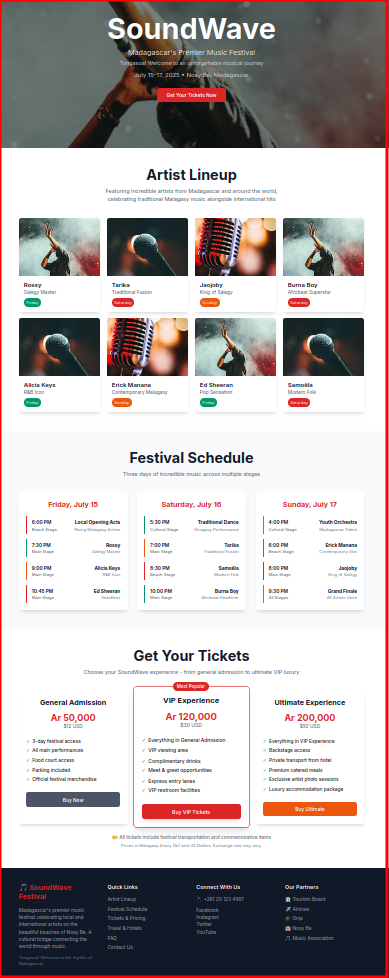

# 🎵 SoundWave Festival 2025 - Tailwind CSS Mini Capstone

**Tongasoa! Welcome to your Tailwind CSS capstone project!**  
Here's a preview of what you'll be building:


    
## 🌟 About This Project

You've been hired as a web developer to create the official website for **SoundWave Festival 2025**, Madagascar's biggest music festival! This exciting event will take place on the beautiful beaches of Nosy Be, featuring both international artists and beloved Malagasy musicians.

Your mission is to build a stunning, responsive festival website using only HTML and Tailwind CSS. No JavaScript required - just pure CSS magic! ✨

## 🎯 What You'll Learn

By the end of this project, you'll master:
- **Responsive Design**: Making websites look amazing on phones, tablets, and computers
- **Tailwind Utilities**: Using utility classes like a pro
- **Layout Systems**: Grid and Flexbox for perfect positioning
- **Typography & Colors**: Creating visual hierarchy and mood
- **Interactive States**: Hover effects and visual feedback
- **Real-world Workflow**: Building a complete project from start to finish

## 🏝️ Festival Theme: Celebrating Madagascar

SoundWave Festival celebrates the rich musical heritage of Madagascar alongside international acts. You'll be showcasing:
- **Malagasy Artists**: Rossy, Tarika, Jaojoby, and rising stars
- **Traditional Meets Modern**: Mixing traditional Salegy, Tsapiky, and Hiragasy with contemporary sounds
- **Beautiful Venue**: Set against the stunning backdrop of Nosy Be's beaches
- **Local Culture**: Incorporating Malagasy colors, patterns, and aesthetics

## 🚀 Getting Started

### Step 1: Open Your Project
1. Navigate to the `starter-files` folder
2. Open `index.html` in your text editor (VS Code recommended)
3. Open `index.html` in your web browser
4. Keep both open side by side for live preview!

### Step 2: Understand the Structure
Your project has this structure:
```
📁 w2_css_tailwind_mini_capstone/
├── 📁 starter-files/          ← Your workspace!
│   ├── 📄 index.html          ← Main file to edit
│   ├── 📁 images/            ← Festival images
│   └── 📄 guidelines.md       ← Design requirements
├── 📁 solution/              ← Final solution (peek only if stuck!)
├── 📁 tests/                 ← Checklist to verify your work
└── 📄 README.md              ← This file!
```

### Step 3: Start Building!
Open `starter-files/index.html` and follow the step-by-step instructions inside the file.

## 🏗️ Building Phases (4-5 hours total)

### Phase 1: Hero Section (45 minutes)
Create an eye-catching hero with festival branding and a stunning background of Nosy Be beaches.

### Phase 2: Navigation (30 minutes)
Build a responsive navigation bar that works perfectly on mobile and desktop.

### Phase 3: Artist Lineup (60 minutes)
Showcase both international and Malagasy artists in beautiful, responsive cards.

### Phase 4: Festival Schedule (45 minutes)
Display the daily program across multiple stages in a mobile-friendly format.

### Phase 5: Ticket Pricing (45 minutes)
Create compelling pricing cards for different ticket tiers.

### Phase 6: Footer & Polish (30 minutes)
Add the finishing touches with social links and sponsor information.

### Stretch Goals (if time permits)
- Enhanced hover animations
- Dark mode toggle (CSS only)
- Accessibility improvements
- Additional sections (travel, sustainability)

## 📱 Responsive Requirements

Your website must look amazing on:
- **Mobile phones** (375px and up)
- **Tablets** (768px and up)
- **Laptops** (1024px and up)
- **Large screens** (1280px and up)

## 🎨 Design System

### Colors (Inspired by Madagascar)
- **Primary**: Red (#DC2626) - from the Malagasy flag
- **Secondary**: Green (#059669) - representing lush nature
- **Accent**: Orange (#EA580C) - like a beautiful sunset
- **Neutral**: Various grays for text and backgrounds

### Typography
- **Headlines**: Bold and impactful
- **Body text**: Clean and readable
- **Artist names**: Stylish and prominent

## 🆘 Getting Help

### If You Get Stuck:
1. **Check the comments**: Each section has detailed instructions
2. **Read the guidelines**: `starter-files/guidelines.md` has design specs
3. **Use the browser**: Right-click → Inspect to see what's happening
4. **Test frequently**: Refresh your browser after each change

### Useful Resources:
- [Tailwind CSS Documentation](https://tailwindcss.com/docs)
- [Tailwind Cheat Sheet](https://tailwindcomponents.com/cheatsheet/)
- [CSS Grid Guide](https://css-tricks.com/snippets/css/complete-guide-grid/)
- [Flexbox Guide](https://css-tricks.com/snippets/css/a-guide-to-flexbox/)

## ✅ How to Check Your Progress

1. **Visual Check**: Does it look good in your browser?
2. **Responsive Check**: Resize your browser window - does everything adapt?
3. **Mobile Check**: Use browser dev tools to simulate mobile devices
4. **Final Checklist**: Use `tests/visual-checklist.md` to verify everything

## 🎉 Success Criteria

You'll know you've succeeded when:
- ✅ Your website looks professional and polished
- ✅ Everything works perfectly on mobile, tablet, and desktop
- ✅ All sections are complete and visually appealing
- ✅ Hover effects and interactions work smoothly
- ✅ The design celebrates both modern web design and Malagasy culture

## 🌟 Ready to Start?

Take a deep breath and let's build something amazing together!

**Your first step**: Open `starter-files/index.html` in your text editor and browser, then start with the Hero Section.

**Soa aman-tsara! (Good luck!)**

---

*Remember: This is your project. Feel free to add your own creative touches and make it uniquely yours while following the core requirements. The best websites are built with both technical skill and personal passion!*
